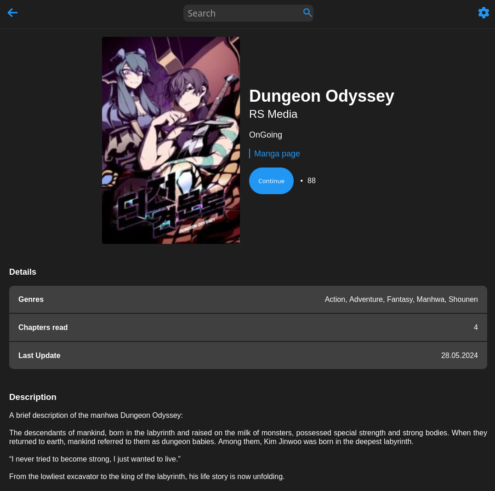
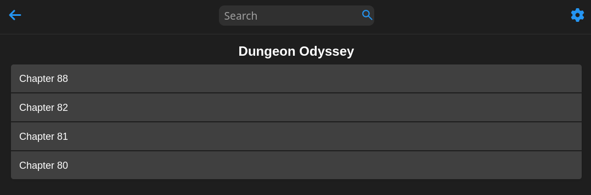
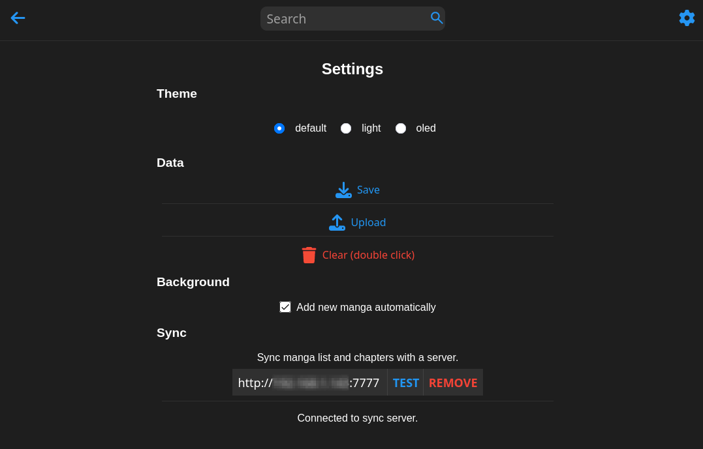

# Pony-s-Manga-Manager

Manga manager to manage mangas on the fly.

## Web extension

[Firefox](https://addons.mozilla.org/fr/firefox/addon/manga-reader-manager/).

## Shortcut

`Ctrl + Shift + M`: Open popup.

## Features

### Sync

1. Syncs manga list with a local server (Docker or Golang).
2. Smart merge of manga list. Add to both side if not found and update if found based on last read time.
3. Data is non-sensitive. Only the exact same data as when you click on save in the Settings.

### Background (while browsing)

1. Automatically add new manga if website supported.
2. Automatically update manga info.

### Popup (when clicked on the extension icon)

1. Ordered by last read time.
2. Save/Load to/from JSON file.
3. Manga info menu.
4. Manga chapters menu.
5. Fetches asynchronously the number of new chapters and the cover image (if different).

## Supported websites

- [x] [Mangaread](https://www.mangaread.org/)
- [x] [Mangakik](https://mangakik.biz/)
- [x] [NeatManga](https://neatmangas.com/)
- [x] [Manhwatop](https://manhwatop.com/)

## Screenshots

### Manga list menu


### Manga info menu



### Manga chapters menu



### Settings menu



## Docker

### Build
```bash
docker build -t manga-manager .
```

```bash
docker run -p 7777:7777 -v <LOCAL_DIR>:/app/data --name MangaManager --pull missing manga-manager:latest
```

## Getting support

If you have any questions, suggestions or bug reports, please create an issue on the [GitHub project page](https://github.com/PonyLucky/Pony-s-Manga-Manager/issues).

## Copyrights

Icon from Pixabay by [Akane-k](https://pixabay.com/illustrations/moe-rice-eat-hamburger-breakfast-3336882/) under [Pixabay License](https://pixabay.com/service/license/).

## License

This project is licensed under the [MIT License](LICENSE).
